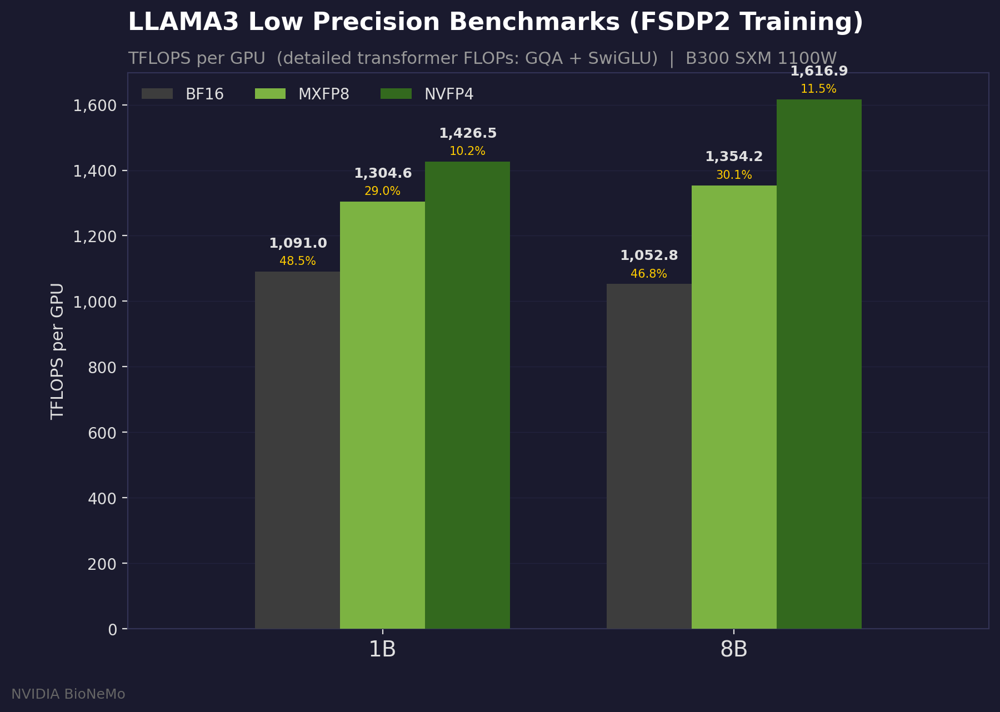
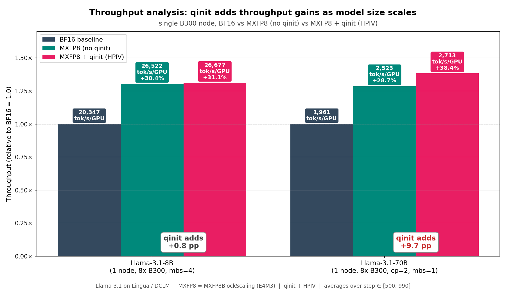
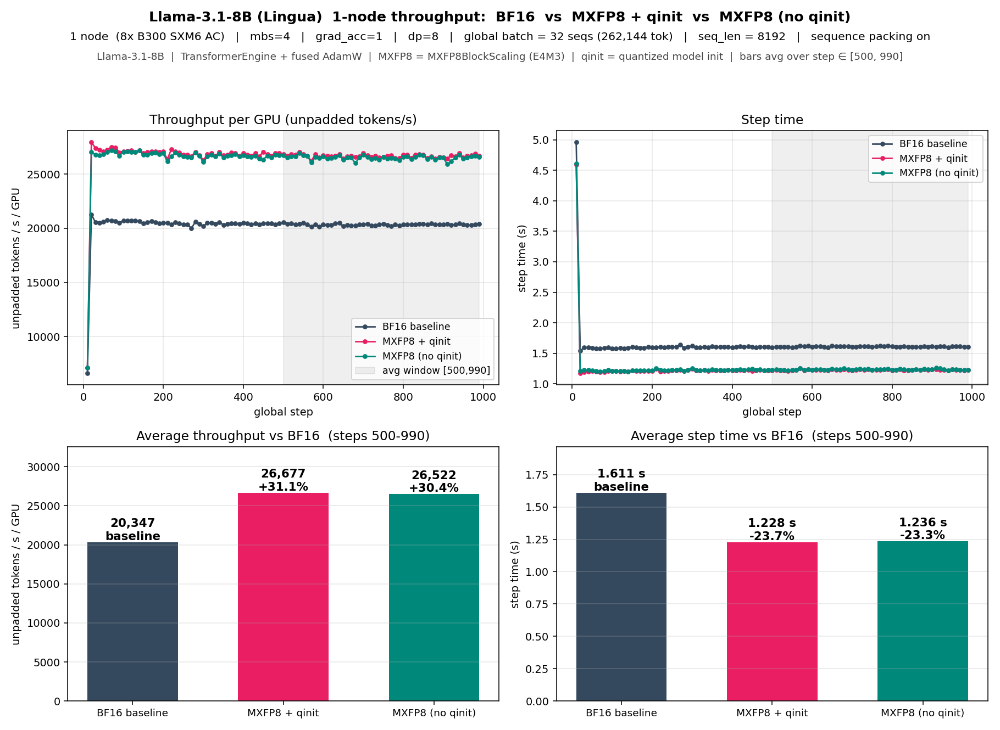
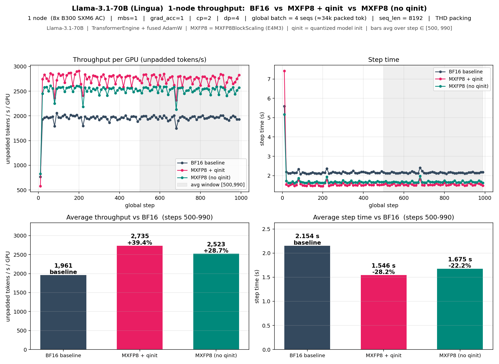
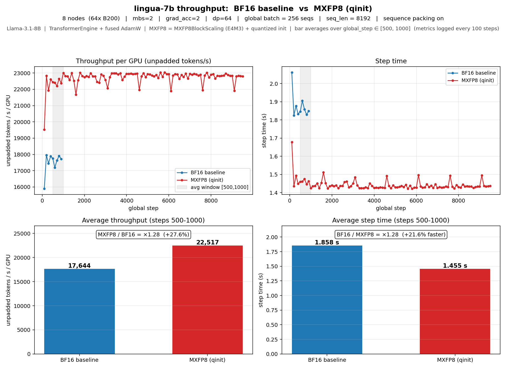
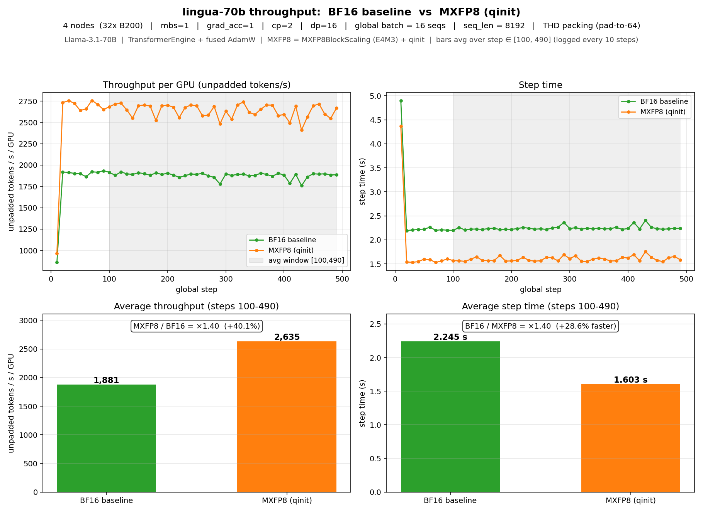
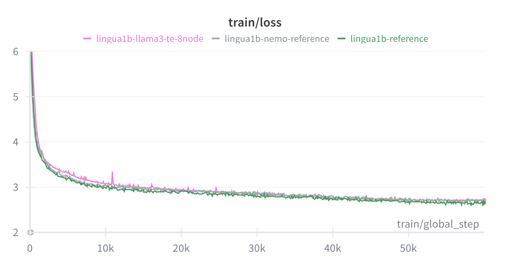
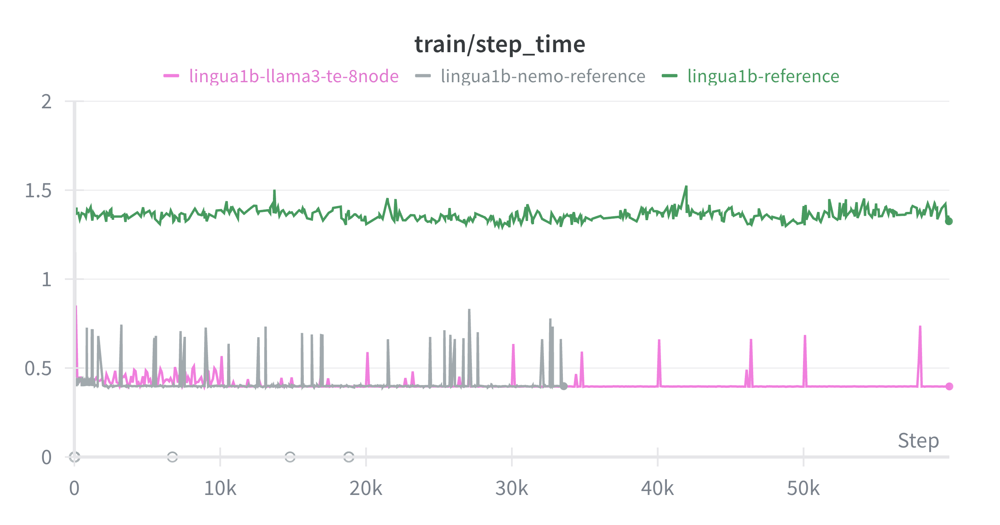

# TransformerEngine-accelerated Llama 3 training with native PyTorch training loop

This folder demonstrates how to train TE-accelerated Llama 3 with a native PyTorch training loop, including sequence
packing, FP8/MXFP8/NVFP4 precision with layer-wise control, using fully sharded data parallel (FSDP) for distributed
training. This recipe is configured for genomic sequences using a custom nucleotide tokenizer.

## How to use this recipe

This folder contains an independent, minimal training example. It does not depend on any other code in the top-level
bionemo-framework repository. You can download a zipped directory of this folder alone by clicking
[here](https://download-directory.github.io?url=https://github.com/NVIDIA-BioNeMo/bionemo-framework/tree/main/bionemo-recipes/recipes/llama3_native_te&filename=llama3-native-te).

### How to deploy this recipe on cloud providers

🚧 Under development

## Supported Models and Training Features

| Model                                    | BF16 | FP8<sup>[1]</sup> | MXFP8<sup>[2]</sup> | NVFP4<sup>[3]</sup> | THD Input Format | Context Parallelism | Tensor Parallelism |
| ---------------------------------------- | ---- | ----------------- | ------------------- | ------------------- | ---------------- | ------------------- | ------------------ |
| [Llama 3](../../models/llama3/README.md) | ✅   | ✅                | ✅                  | ✅                  | ✅               | ✅                  | 🚧                 |

✅: Supported <br/>
🚧: Under development <br/>
❌: Not supported <br/>

\[1\]: Requires [compute capability](https://developer.nvidia.com/cuda-gpus) 9.0 and above (Hopper+) <br/>
\[2\]: Requires [compute capability](https://developer.nvidia.com/cuda-gpus) 10.0 and 10.3 (Blackwell), 12.0 support pending <br/>
\[3\]: Requires [compute capability](https://developer.nvidia.com/cuda-gpus) 10.0 and above (Blackwell+) <br/>

### Installing Dependencies

The easiest way to get started with this recipe is to use the provided Dockerfile, which uses the latest NVIDIA PyTorch
base image to provide optimized versions of PyTorch and TransformerEngine. To build the container, run:

```bash
docker build -t llama3_native_te .
```

To run the container, run:

```bash
docker run -it --gpus all --network host --ipc=host --rm -v ${PWD}:/workspace/bionemo llama3_native_te /bin/bash
```

Alternatively, the dependencies can be installed manually in an environment with CUDA support. See `requirements.txt`
for the list of dependencies.

### Performance Benchmarks

<p align="center">
  
</p>

Scaling Llama 3 70B with Context Parallelism (CP) on 32x NVIDIA GB300 GPUs (NVL32) with synthetic data of increasing
sequence length. MFU was calculated using a 2.5 PFLOPS/GPU maximum theoretical bf16 throughput, with model FLOPS
calculated with the formula

```python
def compute_model_pflops(seq_len, global_batch_size, step_time_s):
    B, S, H, L, V = global_batch_size, seq_len, HIDDEN_DIM, N_LAYERS, VOCAB_SIZE
    model_flops = (
        (24 * B * S * H * H + 4 * B * S * S * H) * (3 * L) + (6 * B * S * H * V)
    ) / step_time_s
    return model_flops / 1e15
```

### Low precision performance benchmarks


In the above plot we can see the performance increases as we lower the precision of our transformer layers across the 1B and 8B variant of LLAMA3.

#### MXFP8 vs BF16 throughput on Llama-3.1 (Lingua / DCLM)

We benchmarked MXFP8 (`MXFP8BlockScaling`, E4M3) against the BF16 baseline using the Lingua / DCLM training setup on NVIDIA Blackwell GPUs. All runs use TransformerEngine, fused AdamW with FP32 master weights, and THD sequence packing.

<p align="center">
  
</p>

**Key finding:** plain MXFP8 over BF16 gives roughly the same ~30% throughput uplift on both 8B and 70B. Quantized model init (`qinit`) adds essentially nothing on 8B (+0.8 pp) but **adds ~10 percentage points on 70B (+9.7 pp)** — the per-layer quantize/dequantize work saved by qinit scales with depth (80 vs 32 transformer layers). On 70B, MXFP8 + qinit delivers a **+38.4% throughput gain over BF16** on a single B300 node.

<details>
<summary><strong>Single-node detail: per-model 3-way comparisons</strong></summary>

The per-model charts below show the 3-way (BF16 / MXFP8 no-qinit / MXFP8 + qinit) comparison underlying the headline figure above.

**Llama-3.1-8B** (1 node / 8× B300 SXM6 AC, mbs=4, grad_acc=1, gbs = 32 seqs / 262k tokens, seq_len = 8192):

<p align="center">
  
</p>

On a single B300 node, **MXFP8 + qinit (+31.1%) and MXFP8 without qinit (+30.4%) deliver essentially the same throughput gain over BF16**. At this layer count the per-layer quantize/dequantize saving qinit provides is small; the speedup comes mainly from the FP8 GEMMs themselves. Averaged over global step ∈ [500, 990].

**Llama-3.1-70B** (1 node / 8× B300 SXM6 AC, mbs=1, grad_acc=1, cp=2, dp=4, gbs = 4 seqs / ≈34k packed tokens, seq_len = 8192):

<p align="center">
  
</p>

On a single B300 node, **MXFP8 + qinit (+39.4%) pulls ahead of MXFP8 without qinit (+28.7%) — a ~10 percentage point gap that doesn't appear at 8B**. With 80 transformer layers, the per-step quantize/dequantize work avoided by qinit (the FP8 weight is already in compute format, so no on-the-fly cast every forward and backward) adds up to a meaningful throughput gain over the no-qinit path. Averaged over global step ∈ [500, 990]. We also separately measured `preserve_high_precision_init_val=True` (HPIV) and found it within 1% of the qinit-without-HPIV throughput, so HPIV's startup-time master-weight seeding is essentially free at steady state.

</details>

<details>
<summary><strong>Multi-node throughput (B200, production-scale runs)</strong></summary>

We also measured MXFP8 + qinit throughput at scale, on multi-node B200 with longer Lingua DCLM runs to confirm the single-node findings hold in production conditions.

**Llama-3.1-8B** (8 nodes / 64× B200, mbs=2, grad_acc=2, global batch = 256 seqs, seq_len = 8192):

<p align="center">
  
</p>

MXFP8 + qinit reaches **22,517 unpadded tokens / s / GPU vs 17,644 for BF16 — a +27.6% throughput gain (×1.28 speedup, −21.7% step time)**. Averaged over global step ∈ [500, 1000].

**Llama-3.1-70B** (4 nodes / 32× B200, cp=2, dp=16, mbs=1, grad_acc=1, gbs = 16 seqs, seq_len = 8192):

<p align="center">
  
</p>

MXFP8 + qinit reaches **2,725 unpadded tokens / s / GPU vs 1,972 for BF16 — a +38.2% throughput gain (×1.40 speedup, −27.6% step time)**. Averaged over global step ∈ [100, 490]. The larger relative gain on 70B vs 8B at scale matches the size-dependent pattern shown in the single-node headline above.

</details>

Wandb runs:

- Single-node 8B — [BF16](https://wandb.ai/clara-discovery/lingua-7b/runs/lingua_7b_bf16_mbs4_1n_bia) / [MXFP8 + qinit](https://wandb.ai/clara-discovery/lingua-7b/runs/lingua_7b_mxfp8_qinit_mbs4_1n_bia) / [MXFP8 (no qinit)](https://wandb.ai/clara-discovery/lingua-7b/runs/lingua_7b_mxfp8_no_qinit_mbs4_1n_bia)
- Single-node 70B (1k steps) — [BF16](https://wandb.ai/clara-discovery/lingua-70b/runs/lingua_70b_bf16_mbs1_1n_1k_bia) / [MXFP8 + qinit](https://wandb.ai/clara-discovery/lingua-70b/runs/lingua_70b_mxfp8_qinit_mbs1_1n_1k_bia) / [MXFP8 + qinit + HPIV](https://wandb.ai/clara-discovery/lingua-70b/runs/lingua_70b_mxfp8_qinit_hpiv_mbs1_1n_1k_bia) / [MXFP8 (no qinit)](https://wandb.ai/clara-discovery/lingua-70b/runs/lingua_70b_mxfp8_no_qinit_mbs1_1n_1k_bia)
- Multi-node 8B — [BF16](https://wandb.ai/clara-discovery/lingua-7b/runs/lingua-7b-bf16-baseline) / [MXFP8 + qinit](https://wandb.ai/clara-discovery/lingua-7b/runs/lingua_7b_mxfp8_qinit_v6_te_main_8n_prenyx)
- Multi-node 70B — [BF16](https://wandb.ai/clara-discovery/lingua-70b/runs/lingua_70b_bf16_thd_fusedadam_4n_cp2_bia) / [MXFP8 + qinit](https://wandb.ai/clara-discovery/lingua-70b/runs/lingua_70b_mxfp8_qinit_thd_fusedadam_4n_cp2_bia)

### Convergence Benchmarks

<p align="center">
  
  
</p>

We compared the convergence of this Llama3 recipe (with FSDP2) against NeMo 2.0
(https://github.com/NVIDIA-NeMo/NeMo) and the [facebookresearch/lingua](https://github.com/facebookresearch/lingua)
implementation on the DCLM Baseline 1.0 dataset. See [Training on Natural Language Data (Lingua
Reproduction)](#lingua-reproduction) for more details. The figure above shows similar loss convergence and step time to
the NeMo 2.0 training example, and the following table shows downstream performance on various tasks using the
[lm-eval](https://github.com/eleutherai/lm-evaluation-harness) library. The variation in training step time every 10,000 steps
are due checkpointing, further work will be done to improve training step time stability.

| name                | arc_challenge | arc_easy | boolq | copa | hella_swag | piqa  | winogrande |
| ------------------- | ------------- | -------- | ----- | ---- | ---------- | ----- | ---------- |
| Llama3 1B (Lingua)  | 32            | 69.32    | 62.94 | 77   | 47.16      | 73.34 | 63.06      |
| Llama3 1B (NeMo2)   | 32.34         | 67       | 59.79 | 78   | 59.09      | 74.43 | 59.83      |
| Llama3 1B (Recipes) | 30.63         | 65.57    | 55.6  | 80   | 44.57      | 73.29 | 58.72      |

Models were trained on 64 NVIDIA H100 GPUs with a micro batch size of 4 and a context length of 4096 for 60,000 steps.
Training was performed with BF16 precision.

### Low Precision convergence benchmarks

For the multi-node 8B run on DCLM, the MXFP8 + quantized init training loss tracks the BF16 baseline to within ~0.1% over 60k steps, confirming the throughput gains above come with no measurable convergence regression. A small additional improvement is observed when keeping the first and last transformer layers in BF16 while running all other layers in MXFP8 (configurable via `fp8_layers`).

### Distributed Training

This recipe supports distributed training using DDP, FSDP2, and FSDP2 with Context Parallelism, shown in three separate training entrypoints:

- [Distributed Data Parallel (DDP)](https://docs.pytorch.org/docs/stable/generated/torch.nn.parallel.DistributedDataParallel.html), shown in `train_ddp.py`
- [Fully Sharded Data Parallel 2 (FSDP2)](https://docs.pytorch.org/docs/stable/distributed.fsdp.fully_shard.html), shown in `train_fsdp2.py`
- FSDP2 with Context Parallelism, shown in `train_fsdp2_cp.py`

## Commands to Launch Training

To run single-process training on one GPU, run:

```bash
python train_fsdp2.py  # or train_ddp.py
```

To run multi-process training locally on 2+ GPUs, run (e.g. 2 GPUs):

```bash
torchrun --nproc_per_node=2 train_fsdp2.py  # or train_ddp.py
```

Multi-Node training is supported with both strategies.

A convergence test configuration (`L0_convergence`) is also available, which uses a tiny Llama model
to verify that the training loop can overfit on a small dataset:

```bash
python train_fsdp2.py --config-name L0_convergence
```

Gradient accumulation is supported with both strategies. To enable gradient accumulation, set `grad_acc_steps` to the
number of steps to accumulate gradients before updating the model parameters. This is useful to scale the effective
batch size while running on a smaller number of GPUs.

```bash
python train_fsdp2.py --config-name L0_sanity grad_acc_steps=2
```

### Quantized Training (FP8 / MXFP8 / NVFP4)

To run training with FP8, enable it by overriding the `fp8_config.enabled=true` configuration parameter. Additional FP8
configuration parameters, including switching to `MXFP8BlockScaling`, can be set using the hydra configuration.

```bash
python train_fsdp2.py --config-name L0_sanity fp8_config.enabled=true
```

#### Quantized Model Initialization

When training with FP8, you can initialize model weights directly in the target quantized format by setting
`config_kwargs.use_quantized_model_init=true`. This tells TransformerEngine to create weights inside a
`te.quantized_model_init` context, avoiding a separate quantization step after initialization.

```bash
python train_fsdp2.py --config-name L0_sanity \
  fp8_config.enabled=true \
  +config_kwargs.use_quantized_model_init=true
```

#### FP8 Debugging

```bash
python train_fsdp2.py --config-name L0_sanity fp4_config.enabled=true
```

Note: This feature is available for the `train_ddp` and the `train_fsdp2` scripts. NVFP4 stats logging is not yet
supported and will be enabled in a future TransformerEngine release; FP8/MXFP8 stats logging works today.

Additional recipe parameters (e.g., switching to `MXFP8BlockScaling`) can be set via the hydra configuration.

#### Layer-Wise Precision

You can control which transformer layers use FP8 or FP4 by specifying 1-indexed layer numbers via `fp8_layers` and
`fp4_layers`. Layers not assigned to either format will run in BF16.

For example, to run layers 1-3 in FP8, layers 4-6 in FP4, and the rest in BF16 on a model with more than 6 layers:

```bash
python train_fsdp2.py --config-name L0_sanity \
  fp8_config.enabled=true \
  fp4_config.enabled=true \
  'fp8_layers=[1,2,3]' \
  'fp4_layers=[4,5,6]'
```

When both `fp8_config` and `fp4_config` are enabled but only one layer list is provided, the other format automatically
claims the remaining layers. For example, if `fp8_layers=[1,2,3]` is set and `fp4_config.enabled=true` with no
`fp4_layers`, then layers 4 through N will default to FP4.

#### Quantization Stats Debugging

We provide a mechanism to log tensor statistics (activations, weights, gradients) for quantized layers during training.
When layer-wise precision is used, the stats config is automatically updated so that only the relevant layers are
tracked.

To enable stats logging:

```bash
python train_fsdp2.py \
  quant_stats_config.enabled=true \
  quant_stats_config.quant_log_dir=./logs/quant_stats \
  quant_stats_config.quant_stats_file=./fp8_debugging_stats.yaml \
  fp8_config.enabled=true
```

Note: This feature is available for the `train_ddp` and the `train_fsdp2` scripts. NVFP4 stats logging is not yet
supported and will be enabled in a future TransformerEngine release; FP8/MXFP8 stats logging works today.

The config file structure [fp8_debugging_stats.yaml](fp8_debugging_stats.yaml) is explained in the
[NVIDIA Transformer Engine config file documentation](https://docs.nvidia.com/deeplearning/transformer-engine/user-guide/debug/2_config_file_structure.html)
in more detail.

Stats collection has a performance cost dependent on the `freq` parameter in the config file. `freq=1` collects stats
on every step which in our experiments caused a ~29% decrease in throughput (executed on a single RTX 5090). We
recommend using `freq>=10` to reduce this performance hit.

### Sequence Packing (THD input format)

Sequence packing is handled via a padding-free collator (in `collator.py`) that provides input arguments (e.g.
`cu_seq_lens_q`) needed for padding-free attention. To enable sequence packing, set `use_sequence_packing=true`
in the hydra configuration.

```bash
python train_fsdp2.py --config-name L0_sanity use_sequence_packing=true
```

### FP8 and Sequence Packing

To combine FP8 training with sequence packing, the number of unpadded input tokens must be a multiple of 16. The data
collator will automatically pad packed sequences to the maximum number of tokens per batch.

```bash
python train_fsdp2.py --config-name L0_sanity \
  fp8_config.enabled=true \
  use_sequence_packing=true
```

### Context Parallel Training

Context parallelism splits each sequence across multiple GPUs along the sequence dimension, enabling training with very
long sequences. Use `train_fsdp2_cp.py` with the `L0_sanity_cp` configuration and set `cp_size` to the number of context
parallelism ranks. Works with both BSHD (no padding) and THD (padding) input formats. Only TE models are supported.

```bash
torchrun --nproc_per_node=4 train_fsdp2_cp.py --config-name L0_sanity_cp cp_size=2
```

## Downloading Pre-Training Data For Offline Training

This recipe is configured to use genomic sequences. The default configuration uses a local test file
`test_genomic_sequences.parquet`.

For large-scale training, you can point the dataset configuration to a directory containing Parquet files or a Hugging
Face dataset, e.g., for the DCLM Baseline 1.0 dataset:

```bash
hf download mlfoundations/dclm-baseline-1.0 \
 --repo-type dataset --include 'global-shard_01_of_10/*' \
 --local-dir /path/to/download/directory

python train_fsdp2.py --config-name L0_sanity \
  dataset.load_dataset_kwargs.path=/path/to/download/directory
```

## Training on Natural Language Data (Lingua Reproduction) {#lingua-reproduction}

We provide a configuration to reproduce the Llama-3.2-1B training experiments from [Meta
Lingua](https://github.com/facebookresearch/lingua), using the [DCLM Baseline
1.0](https://huggingface.co/datasets/mlfoundations/dclm-baseline-1.0) dataset.

To launch this training, use the `L2_lingua_1b` configuration:

```bash
python train_fsdp2.py --config-name L2_lingua_1b
```

This configuration:

- Uses the `meta-llama/Llama-3-8B` tokenizer (requires Hugging Face login).
- Streams the `mlfoundations/dclm-baseline-1.0` dataset.
- Sets up training parameters to match the Lingua 1B baseline.

Note: Ensure you have authenticated with Hugging Face (`huggingface-cli login`) to access the tokenizer if it requires
gated access, or update the config to use a public Llama 3 tokenizer.

## Saving and Loading Checkpoints

To enable checkpoint saving, ensure that `checkpoint.ckpt_dir` is set to a writable directory. Checkpointing frequency is
controlled by the `checkpoint.save_every_n_steps` configuration parameter.

```bash
python train_fsdp2.py --config-name L0_sanity \
  checkpoint.ckpt_dir=/path/to/ckpt_dir \
  checkpoint.save_every_n_steps=100
```

To enable checkpoint loading, set `checkpoint.resume_from_checkpoint=true` to resume from the latest checkpoint.

```bash
python train_fsdp2.py --config-name L0_sanity \
  checkpoint.ckpt_dir=/path/to/ckpt_dir \
  checkpoint.resume_from_checkpoint=true
```

We also show how to export a final model at the end of training, which is suitable for uploading to the Hugging Face Hub
or for local inference as a more durable format than torch distributed checkpoints. To enable this, set
`checkpoint.save_final_model=true` in the hydra configuration. The resulting model will be saved to the `final_model`
directory within the checkpoint directory.

## Saving Dataloader State with `StatefulDataLoader`

These examples show how to save and resume your dataloader by passing the dataloader instance to our `save_checkpoint_*`
and `load_checkpoint_*` functions using the `StatefulDataLoader` class from `torchdata`. See `checkpoint.py` for
implementation details.

## Performance Profiling with NVIDIA Nsight Systems

This recipe includes built-in support for profiling with NVIDIA Nsight Systems, which provides detailed performance
traces including CUDA kernels, CPU activities, memory operations, and NVTX ranges. The profiler allows you to specify
the exact training step range to profile.

### Basic Usage (Single GPU)

To profile a training run on a single GPU:

```bash
nsys profile \
  -o nsight_trace \
  --trace=cuda,nvtx,osrt,cudnn,cublas \
  --pytorch=autograd-nvtx \
  --capture-range=cudaProfilerApi \
  --capture-range-end=stop \
  python train_fsdp2.py \
    profiler.enabled=true \
    profiler.start_step=10 \
    profiler.end_step=15
```

**Profiler Configuration Parameters:**

- `profiler.enabled`: Enable/disable profiling (default: false)
- `profiler.start_step`: Training step at which to start profiling (default: 10)
- `profiler.end_step`: Training step at which to end profiling (default: 15)

**Nsight Systems Flags:**

- `--pytorch=autograd-nvtx`: Adds NVTX markers for PyTorch autograd operations (forward/backward passes, optimizer steps). This helps visualize the training loop structure and identify bottlenecks in the computation graph.
- `--pytorch-backtrace=cuda`: Captures Python backtraces for CUDA kernel launches, helping identify which Python code triggered each kernel. This is invaluable for debugging performance issues and understanding which operations are expensive.
- `--python-sampling=true` (optional): Periodically samples Python call stacks to identify CPU-side bottlenecks. Useful when investigating data loading, preprocessing, or Python overhead. Adds ~5-15% overhead, so only use when needed.

**Note**: The PyTorch-specific flags (`--pytorch=autograd-nvtx` and `--pytorch-backtrace=cuda`) add minimal overhead but provide significantly more detailed insights into PyTorch operations, making them highly recommended for training workload profiling. Use `--python-sampling=true` only when investigating CPU/Python performance.

The profiler will start capturing performance data at `start_step` and stop at `end_step`. It's recommended to start profiling after a few steps to allow training to stabilize.

### Multi-GPU Profiling

For distributed training, **profiling is only performed on global rank 0** to minimize overhead and avoid redundant data
collection. Other ranks will skip profiling automatically.

#### Multi-GPU on Single Node

```bash
nsys profile \
  -o nsight_trace_rank0 \
  --trace=cuda,nvtx,osrt,cudnn,cublas \
  --pytorch=autograd-nvtx \
  --pytorch-backtrace=cuda \
  --capture-range=cudaProfilerApi \
  --capture-range-end=stop \
  torchrun --nproc_per_node=2 train_fsdp2.py \
    profiler.enabled=true
```

For more information on Nsight Systems, see the [official documentation](https://docs.nvidia.com/nsight-systems/).

## Running Inference with the Trained Model

Models can be loaded from the final checkpoint directory using the `AutoModelForCausalLM` method (or
`NVLlamaForCausalLM` if using TE layers directly, though standard HF loading works if the `config.json` is updated to
include an `auto_map` entry for `modeling_llama_te.NVLlamaForCausalLM` and the custom forward pass is packaged in the
checkpoint directory).

If you trained with TE layers (which is the default in this recipe), you can use the `NVLlamaForCausalLM` class for
inference, which supports high-performance generation with TE-provided `InferenceParams` key-value cache class.

```python
import torch
from transformers import AutoTokenizer
from transformer_engine.pytorch.attention import InferenceParams
from modeling_llama_te import NVLlamaForCausalLM, NVLlamaConfig

# Load the model configuration and weights
config = NVLlamaConfig.from_pretrained("path/to/final_model")
model = NVLlamaForCausalLM.from_pretrained("path/to/final_model", config=config)
tokenizer = AutoTokenizer.from_pretrained("./tokenizers/nucleotide_fast_tokenizer")

model.to("cuda")
model.eval()

# Example genomic sequence
sequence = "ACGTACGT"
inputs = tokenizer(sequence, return_tensors="pt").to("cuda")

# Setup inference parameters for efficient generation
past_key_values = InferenceParams(
    max_batch_size=1,
    max_sequence_length=256,
    num_heads_kv=model.config.num_key_value_heads,
    head_dim_k=model.config.hidden_size // model.config.num_attention_heads,
    dtype=torch.bfloat16,
    qkv_format="thd",
    max_ctx_len=256,
)

for layer_number in range(1, model.config.num_hidden_layers + 1):
    past_key_values.allocate_memory(layer_number)

# Generate
with torch.no_grad():
    output_ids = model.generate(
        **inputs, max_new_tokens=16, use_cache=True, past_key_values=past_key_values
    )

generated_text = tokenizer.batch_decode(output_ids, skip_special_tokens=True)
print(generated_text)
```

### Converting to Hugging Face Format

If you want to convert the trained TE model back to a standard Hugging Face `LlamaForCausalLM` (e.g., to use with vLLM
or SGLang), you can use the provided conversion script in `../../models/llama3/convert.py`.

```python
import torch
from transformers import AutoTokenizer
from modeling_llama_te import NVLlamaForCausalLM, NVLlamaConfig
from convert import convert_llama_te_to_hf  # Import from ../../models/llama3/convert.py

# Load TE model
config = NVLlamaConfig.from_pretrained("path/to/final_model")
model_te = NVLlamaForCausalLM.from_pretrained("path/to/final_model", config=config)

# Convert to HF
model_hf = convert_llama_te_to_hf(model_te)

# Save HF model
model_hf.save_pretrained("path/to/hf_converted_model")
tokenizer = AutoTokenizer.from_pretrained("./tokenizers/nucleotide_fast_tokenizer")
tokenizer.save_pretrained("path/to/hf_converted_model")
```

Once converted, the model can be loaded by any library that supports Llama 3, such as
[vLLM](https://github.com/vllm-project/vllm) or [SGLang](https://github.com/sgl-project/sglang).

```bash
# Example vLLM usage
vllm serve path/to/hf_converted_model
```

## Developer Guide

### Running tests

To run tests locally, run `recipes_local_test.py` from the repository root with the recipe directory as an argument.

```bash
./ci/scripts/recipes_local_test.py bionemo-recipes/recipes/llama3_native_te/
```

### Development container

To use the provided devcontainer, use "Dev Containers: Reopen in Container" from the VSCode menu, and choose the
"BioNeMo Recipes Dev Container" option. To run the tests inside the container, run `pytest -v .` in the recipe
directory.

### Hydra Tips

[Hydra](https://hydra.cc/) is a powerful configuration management library for Python. This recipe uses Hydra to manage
training configurations, allowing for easy modification of training hyper-parameters and model settings.

Configuration parameters can be overridden from the command line, e.g.
`python train_fsdp2.py --config-name L0_sanity fp8_config.enabled=true`.
