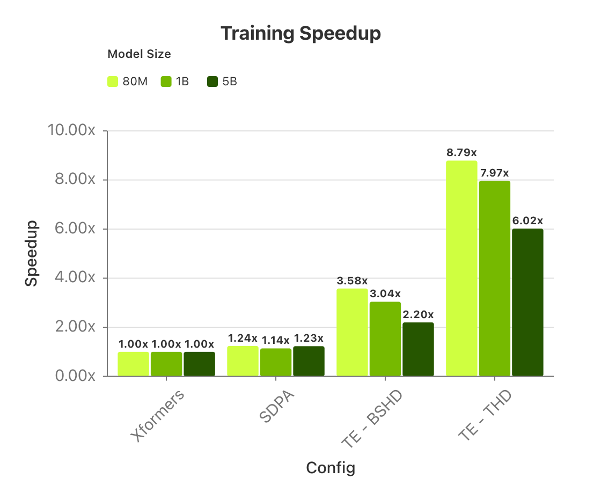
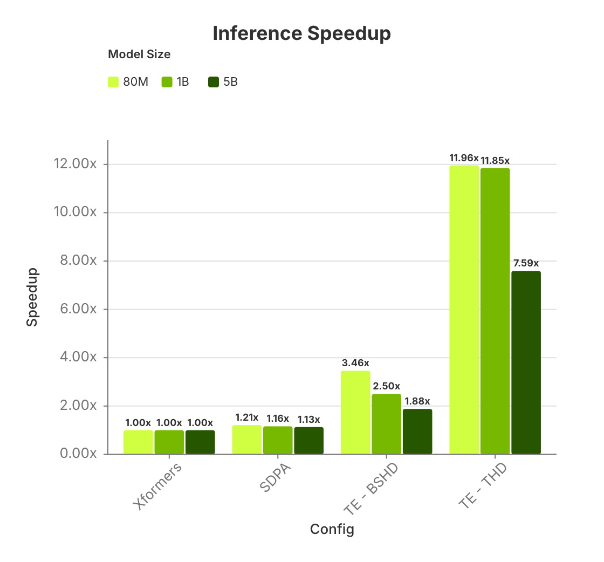

> Disclaimer: This is an isolated model recipe based on PyTorch Lightning, which requires its own dockerized environment -- in the local folder - to be run successfully.

# Codon FM: Foundation Models for Codon Sequences

[Codon FM](https://research.nvidia.com/labs/dbr/assets/data/manuscripts/nv-codonfm-preprint.pdf) is a fully open-source suite of foundation models trained directly on codon sequences to learn contextual codon representations and enable downstream codon-aware tasks.
This is a TransformerEngine accelerated reproduction of https://github.com/NVIDIA-Digital-Bio/CodonFM, which was published in [https://research.nvidia.com/labs/dbr/assets/data/manuscripts/nv-codonfm-preprint.pdf](https://research.nvidia.com/labs/dbr/assets/data/manuscripts/nv-codonfm-preprint.pdf). The research repository contains exact code used in the original scientific exploration, while this repository contains performance accelerations and maintenance updates for community reuse.
We release the entire codebase, pre-training/finetuning scripts, evaluation jupyter notebooks, dockerized environments, experiment templates, and downloadable pre-trained model weights—under an open license for transparent and reproducible use. Our primary model family, EnCodon, uses masked language modeling over codons with scalable architectures (80M, 600M, 1B) and efficient memory-mapped data pipelines.

## Origin

This recipe offers [NVIDIA Transformer Engine (TE)](https://docs.nvidia.com/deeplearning/transformer-engine/user-guide/index.html) accelerated code for training and inference in addition to the original PyTorch workflow. Hence, the folder structure and most of the code is copied from the original PyTorch based research repository
https://github.com/NVIDIA-Digital-Bio/CodonFM, based on the paper [https://research.nvidia.com/labs/dbr/assets/data/manuscripts/nv-codonfm-preprint.pdf](https://research.nvidia.com/labs/dbr/assets/data/manuscripts/nv-codonfm-preprint.pdf). We also provide a checkpoint conversion script between PyTorch and TransformerEngine architecture.

## Pre-Trained Models

The table below summarizes the set of open source pre-trained weights currently made available. All of the training scripts are contained in the directory `experiment_scripts/pretraining/encodon_filtered/`.

| Model              | Variant                        | Hidden size | Layers | Heads | Intermediate | Script                | Original Checkpoint                                                 | TransformerEngine Checkpoint                                           |
| ------------------ | ------------------------------ | ----------- | ------ | ----- | ------------ | --------------------- | ------------------------------------------------------------------- | ---------------------------------------------------------------------- |
| EnCodon 80M        | MLM (random p=0.15)            | 1024        | 6      | 8     | 4096         | `mlm/encodon_80m.sh`  | [Link](https://huggingface.co/nvidia/NV-CodonFM-Encodon-80M-v1)     | [Link](https://huggingface.co/nvidia/NV-CodonFM-Encodon-TE-80M-v1)     |
| EnCodon 600M       | MLM (random p=0.15)            | 2048        | 12     | 16    | 8192         | `mlm/encodon_600m.sh` | [Link](https://huggingface.co/nvidia/NV-CodonFM-Encodon-600M-v1)    | [Link](https://huggingface.co/nvidia/NV-CodonFM-Encodon-TE-600M-v1)    |
| EnCodon 1B         | MLM (random p=0.15)            | 2048        | 18     | 16    | 8192         | `mlm/encodon_1b.sh`   | [Link](https://huggingface.co/nvidia/NV-CodonFM-Encodon-1B-v1)      | [Link](https://huggingface.co/nvidia/NV-CodonFM-Encodon-TE-1B-v1)      |
| EnCodon 1B (CDSWT) | MLM (codon frequency-weighted) | 2048        | 18     | 16    | 8192         | `cdswt/encodon_1b.sh` | [Link](https://huggingface.co/nvidia/NV-CodonFM-Encodon-Cdwt-1B-v1) | [Link](https://huggingface.co/nvidia/NV-CodonFM-Encodon-TE-Cdwt-1B-v1) |

> Note (May 2026): The EnCodon 5B model checkpoint will be released in the near future.

## Repository Structure

High-level overview (NerdTree-style):

```
codonfm_ptl_te/
├── src/ — core library and CLI entrypoints
│   ├── runner.py — entry for pretrain/finetune/eval
│   ├── config.py — model/data/trainer configs
│   ├── tasks.py — pretraining/finetuning/eval tasks
│   ├── models/ — model definitions and components
│   │   ├── encodon_pl.py - PyTorch Lightning module of Pytorch Encodon model
│   │   └── encodon_te_pl.py - PyTorch Lightning module of TE Encodon model
│   ├── data/ — datamodules, datasets, preprocess
│   │   └── preprocess/ — item level process items
│   ├── inference/ — inference wrappers and prediction definitions
│   ├── tokenizer/ — codon tokenizer and mappings
│   └── utils/ — logging, schedulers, writers, helpers
├── experiment_scripts/ — launch scripts
│   ├── pretraining/ — EnCodon pretraining
│   └── finetuning/ — task-specific finetuning
├── data_scripts/ — data download and curation tools
├── notebooks/ — analysis and evaluation notebooks
├── codonfm_ckpt_te_conversion.py — checkpoint conversion between PyTorch and TE
├── Dockerfile — Dockerfile used to create the docker container
├── run_dev.sh - bash script to build and launch docker container
├── pyproject.toml — project file used for creating the codon-fm-te pip package
├── README.md — repo guide
└── LICENSE — license
```

## NVIDIA TransformerEngine Optimization Benchmarks

Several Encodon model versions are benchmarked: The first is the original [research code](https://github.com/NVIDIA-Digital-Bio/CodonFM) - PyTorch transformer layers using [Xformers](https://github.com/facebookresearch/xformers) library's attention function. The second switches Xformers with PyTorch's native [Scaled Dot Product Attention (SDPA)](https://docs.pytorch.org/docs/stable/generated/torch.nn.functional.scaled_dot_product_attention.html)implementation, which does not affect checkpoint compatibility to the original research code. The third is the codebase in this repository which uses TransformerEngine transformer layers. The variants change the training/inference speeds while the model scientific benchmarks and accuracy is unchanged.

The SPDA and TransformerEngine implementations are available in this codebase:

1. The default is the PyTorch native transformer based model with SDPA attention implementation.
2. Transformer Engine (TE) acceleration that is enabled with `--use_transformer_engine` in `runner.py`. This can also be seen below in our sample commands. Moreover, if you would like to increase training performance, enable THD sequence packing, use `--attn_input_format=thd` and `--collate_fn=thd`. For more information on sequence packing refer to this [link](https://huggingface.co/blog/sirluk/llm-sequence-packing). The custom TE-based model definition is located here `src/models/components/encodon_te_layer.py` and encapsulated within the `TETransformerLayer`. There are two "flavors" of TE Encodon models available:

- **Exact**: An exact reproduction of the original research code architecture
- **Non-Exact**: A variant that uses a different implementation of a transformer that is native to the TE library (differing in LayerNorms), and gives similar scientific accuracy but with a simpler and fewer lines-of-code implementation of the model.
  The default and recommended version is the "exact" version, which is the default and can be toggled using the environment variable `CODON_FM_TE_IMPL=exact`.

<details>
<summary><b>Advanced: "Non-exact" TE Implementation (Optional)</b></summary>

We also present the ability to utilize a simpler model architecture that directly employs Transformer Engine's `TransformerLayer`. This implementation will not directly match the PyTorch (baseline) model (1) but it is simpler to use. To use it please set `export CODON_FM_TE_IMPL=nonexact`. Checkpoints cannot be converted from (1) to this model. This is more for educational purposes to show users the minimal code changes to lead to a TE-accelerated model. We verified that despite the slight architectural difference, this model converges on par with the original architecture.

</details>

<br>

The figure below shows training throughput speedups, derived from `tokens/s/gpu`, for the `80M` and `1B` Encodon models when Transformer Engine (TE) and sequence packing (THD) are applied relative to the Xformers-based baseline.



All training experiments reported here were run on `8 x NVIDIA H100 80GB HBM3` GPUs in `bfloat16` precision. The absolute throughputs used to compute the speedups above are reported below in `tokens/s/gpu`.

| Model | Xformers (`tokens/s/gpu`) | SDPA (`tokens/s/gpu`) | TE-BSHD (`tokens/s/gpu`) | TE-THD (`tokens/s/gpu`) | Speedup over baseline         |
| ----- | ------------------------: | --------------------: | -----------------------: | ----------------------: | ----------------------------- |
| 80M   |                    117119 |                145357 |                   419087 |                 1028891 | 1.00x / 1.24x / 3.58x / 9.79x |
| 1B    |                      8698 |                  9899 |                    26476 |                   69300 | 1.00x / 1.14x / 3.04x / 7.97x |
| 5B    |                      2320 |                  2865 |                     5112 |                   13973 | 1.00x / 1.23x / 2.20x / 6.02x |

For inference, we report both relative speedup and absolute throughput. The figure below compares inference configurations by relative speedup within each model size.



All inference experiments reported here were run on `8 x NVIDIA H100 80GB HBM3` GPUs in `bfloat16` precision. The absolute throughputs used to compute the speedups above are reported below in `tokens/s/gpu`.

| Model | Xformers (`tokens/s/gpu`) | SDPA (`tokens/s/gpu`) | TE-BSHD (`tokens/s/gpu`) | TE-THD (`tokens/s/gpu`) | Speedup over baseline          |
| ----- | ------------------------: | --------------------: | -----------------------: | ----------------------: | ------------------------------ |
| 80M   |                    156819 |                190380 |                   542147 |                 1875140 | 1.00x / 1.21x / 3.46x / 11.96x |
| 1B    |                     18655 |                 21715 |                    46551 |                  221110 | 1.00x / 1.16x / 2.50x / 11.85x |
| 5B    |                      5316 |                  5991 |                     9996 |                   40373 | 1.00x / 1.13x / 1.88x / 7.59x  |

## Quickstart

To run the scripts in this repository, we recommend using the provided Docker setup.

### 1. Clone the repository

```bash
git clone https://github.com/NVIDIA/bionemo-framework/tree/main
cd recipes/codonfm_ptl_te
```

### 2. Docker Setup

The fastest way to get up and running with CodonFM is through the Docker setup below. This is an interactive development environment, you can build and launch a container that mounts your local repository. This allows you to edit code locally and run it inside the container.

To build and launch the development container, simply run the following from the root folder:

```bash
bash run_dev.sh
```

This script will:

1. Build the development Docker image using the `development` target in the `Dockerfile`.
2. Pass your user and group IDs to the container to avoid permission issues with mounted files.
3. Stop and remove any existing container with the same name.
4. Launch a new container with your local code mounted at `/workspace`, GPU access, host networking, and common directories for data and SSH keys.

You can also customize the data and checkpoint directory paths by passing arguments:

```bash
bash run_dev.sh --data-dir /path/to/your/data --checkpoints-dir /path/to/your/checkpoints
```

You will be dropped into a `bash` shell inside the container as a non-root user.

You can also use the VSCode `./.devcontainer`. Ensure you mount your data and checkpoints by editing `./devcontainer/devcontainer.json`.

#### Evaluation Notebooks

A series of notebooks are provided in the [notebooks](notebooks) directory show casing multiple use cases such as zero-shot variant prediction and finetuning on downstream tasks. The following is a brief overview:

| Notebook                                                                                                                       | Description                                                                                                                                                                                                                                                                                              |
| ------------------------------------------------------------------------------------------------------------------------------ | -------------------------------------------------------------------------------------------------------------------------------------------------------------------------------------------------------------------------------------------------------------------------------------------------------- |
| [00-Mutation-Datasets-Preprocessing.ipynb](notebooks/00-Mutation-Datasets-Preprocessing.ipynb)                                 | Prepare and harmonize mutation datasets used across evaluations. Prerequisite for `0-Zero-Shot-Mutation-Variant-CancerHotspot.ipynb`, `1-Zero-Shot-Mutation-Variant-DDD-ASD.ipynb`, `2-Zero-Shot-Mutation-Variant-Clinvar-Alphamissense.ipynb`, `3-Zero-Shot-Mutation-Variant-Clinvar-Synonymous.ipynb`. |
| [0-Zero-Shot-Mutation-Variant-CancerHotspot.ipynb](notebooks/0-Zero-Shot-Mutation-Variant-CancerHotspot.ipynb)                 | Zero-shot variant effect scoring on Cancer Hotspots.                                                                                                                                                                                                                                                     |
| [1-Zero-Shot-Mutation-Variant-DDD-ASD.ipynb](notebooks/1-Zero-Shot-Mutation-Variant-DDD-ASD.ipynb)                             | Zero-shot scoring on Deciphering Developmental Disorders (DDD) and autism spectrum disorder (ASD) cohort study, which catalogs genetic mutations linked to rare pediatric and developmental diseases, to evaluate separation of healthy versus disease coh on coding sequence context.                   |
| [2-Zero-Shot-Mutation-Variant-Clinvar-Alphamissense.ipynb](notebooks/2-Zero-Shot-Mutation-Variant-Clinvar-Alphamissense.ipynb) | Zero-shot evaluation on ClinVar missense variants classifying benign vs. pathogenic                                                                                                                                                                                                                      |
| [3-Zero-Shot-Mutation-Variant-Clinvar-Synonymous.ipynb](notebooks/3-Zero-Shot-Mutation-Variant-Clinvar-Synonymous.ipynb)       | Zero-shot evaluation on ClinVar synonymous variants evaluating how the models separate benign versus pathogenic synonymous mutations.                                                                                                                                                                    |
| [4-EnCodon-Downstream-Task-riboNN.ipynb](notebooks/4-EnCodon-Downstream-Task-riboNN.ipynb)                                     | Predicts ribosome profiling signal intensity along coding sequences, evaluating how well models capture translation efficiency and codon-level regulation from sequence context.                                                                                                                         |
| [5-EnCodon-Downstream-Task-mRFP-expression.ipynb](notebooks/5-EnCodon-Downstream-Task-mRFP-expression.ipynb)                   | Predicts fluorescent protein expression levels (mRFP) from coding sequences, testing how accurately models capture codon-dependent effects on translation efficiency and protein abundance.                                                                                                              |
| [6-EnCodon-Downstream-Task-mRNA-stability.ipynb](notebooks/6-EnCodon-Downstream-Task-mRNA-stability.ipynb)                     | Predicts mRNA stability from coding sequences evaluating how the models associate codon composition with stability of mRNA.                                                                                                                                                                              |

### Data Preparation

#### Pre-training Dataset

In order to create the data required for pretraining, follow the guidance outlined in [data_scripts/data_curation/README](./data_scripts/data_curation/README).

#### Evaluation Datasets

- mRFP expression and mRNA stability:
  - Open and run the notebooks `notebooks/5-EnCodon-Downstream-Task-mRFP-expression.ipynb` and `notebooks/6-EnCodon-Downstream-Task-mRNA-stability.ipynb`. These notebooks contain cells that download/prepare the datasets and guide you through executing the evaluations end-to-end.
- Mean translation efficiency prediction task:
  - Open and run the notebook `notebooks/4-EnCodon-Downstream-Task-riboNN.ipynb`. It will download/prepare the downstream dataset and guide you through finetuning on this downstream task.
- Synonymous, DDD/ASD, and Cancer Hotspot variant datasets:
  - Follow `notebooks/00-Mutation-Datasets-Preprocessing.ipynb`. This notebook includes a cell that lists the required input files (with expected names/locations) and outlines how to process them into harmonized formats.
  - After preprocessing, use the task-specific notebooks in `notebooks/` (fir example, `0-...CancerHotspot.ipynb` and `1-...DDD-ASD.ipynb`), which consume the harmonized outputs produced by the preprocessing notebook.

### Running Training/Finetuning/Evaluation

The main entry point is `src/runner.py` which supports three modes:

#### Pre-training

The explicit scripts used to train the released checkpoints are referenced in [Pre-trained Models](#pre-trained-models).

```{note}
- If `--use_transformer_engine` is added TransformerEngine will be used, otherwise it will default to PyTorchs Scaled Dot Product Attention (SDPA).
- For some hardware devices, there may be issues with Transformer Engine's fused attention kernel and sequence packing (THD). To disable this kernel, use `export NVTE_FUSED_ATTN=0`.
```

```bash
python -m src.runner pretrain \
    --out_dir <output_dir> \
    --exp_name <experiment_name> \
    --model_name <model_size> \
    --data_path <path_to_data> \
    --process_item mlm_memmap \
    --dataset_name CodonMemmapDataset \
    --lr <learning_rate> \
    --num_gpus <num_gpus> \
    --num_nodes <num_nodes> \
    --collate_fn <thd/bshd> \
    --attn_input_format <thd/bshd> \
    [--use_transformer_engine]
```

Optional path overrides:

```bash
  --out_dir <dir>
  --checkpoints_dir <dir>
```

- `--out_dir`: Base output directory for logs, metrics, and other artifacts. Defaults to `results/`.
- `--checkpoints_dir`: Directory where training checkpoints are saved. Defaults to `<out_dir>/checkpoints/`. This directory also enables **automatic resumption**: if the runner finds a `last.ckpt` file inside this directory, it will reload the model weights and full trainer state (optimizer, learning-rate schedule, global step, etc.) so training picks up exactly where it left off. This is essential for long pretraining runs on clusters where jobs may be preempted or interrupted. On a fresh run the directory will be empty, so training starts from scratch as expected.

For multi-node execution consider using `torchrun`.

```bash
export NUM_GPUS=$(nvidia-smi --query-gpu=gpu_name --format=csv,noheader | wc -l)
torchrun \
    --nnodes=$NNODES \
    --nproc_per_node=$NUM_GPUS \
    --node_rank=$NODE_RANK \
    --master_addr=$MASTER_ADDR \
    --master_port=$MASTER_PORT \
  -m src.runner pretrain \
    --out_dir <output_dir> \
    --exp_name <experiment_name> \
    --model_name <model_size> \
    --data_path <path_to_data> \
    --process_item mlm_memmap \
    --dataset_name CodonMemmapDataset \
    --lr <learning_rate> \
    --num_gpus $NUM_GPUS \
    --num_nodes $NNODES \
    --collate_fn <thd/bshd> \
    --attn_input_format <thd/bshd> \
    [--use_transformer_engine]
```

**Available `--process_item` options:**

- `mlm_memmap`: Constructs MLM training examples using memory-mapped data input format.
- `mutation_pred_mlm`: Constructs mutation prediction scoring input for the model using ref/alt/mut pos
- `mutation_pred_likelihood`: Constructs input sentence with alt mutation at input to be scored by the model.
- `codon_sequence`: Constructs a codon sequence that can be input into the model.

**Available `--dataset_name` options:**

- `CodonMemmapDataset`: Dataset to support memory-mapped pre-training dataset used for pre-training
- `MutationDataset`: Dataset for mutation prediction
- `CodonBertDataset`: Dataset to ingest codon sequences.

#### Fine-tuning

The publicly available checkpoints can be finetuned using the finetuning options.

**Available finetuning options:**

Refer to example script at `experiment_scripts/pretraining/encodon_filtered/finetuning/`.

- `lora`: Fine-tunes low-rank adapters within a pretrained model added to each transformer layer to reduce training cost and memory usage.
- `head_only_random`: Trains a randomly initialized output head while the remainder of the model is kept frozen.
- `head_only_pretrained`: Trains a pretrained output head while the remainder of the model is kept frozen.
- `full`: Fine-tunes all parameters of the model end-to-end

This is an example commandline for running finetuning:

```bash
python -m src.runner finetune \
    --out_dir <output_dir> \
    --exp_name <experiment_name> \
    --model_name <model_size> \
    --pretrained_ckpt_path <path_to_pretrained_checkpoint> \
    --data_path <path_to_data> \
    --process_item mutation_pred_mlm \
    --dataset_name MutationDataset \
    --finetune_strategy <strategy> \
    [--use_transformer_engine]

```

- `--pretrained_ckpt_path`: Path to a pretrained checkpoint whose **model weights only** are loaded as the starting point for finetuning. The optimizer state, learning-rate schedule, and global step are not restored — training starts fresh from step 0 with the pretrained weights. Accepts a local `.ckpt` file, a local directory containing a `.safetensors` file and `config.json`, or a HuggingFace Hub repo ID (e.g. `nvidia/codon-fm-base`).
- `--checkpoints_dir`: Directory where finetuning checkpoints are saved. Defaults to `<out_dir>/checkpoints/`. If the runner finds a `last.ckpt` here, it resumes the finetuning run (model weights, optimizer, step count) from that checkpoint instead of starting from the pretrained weights. This enables automatic resumption of interrupted finetuning jobs.
- `--resume_trainer_state`: When set, restores the full trainer state (optimizer, scheduler, step count) from the pretrained checkpoint rather than only loading model weights. Useful when continuing a pretraining run as a finetuning job.

#### Evaluation

The publicly available checkpoints can be used to launch scientific evaluation and benchmarking.

**Available tasks**

- `mutation_prediction`: Scores a specified mutation with ref-vs-alt codon log-likelihood ratio.
- `masked_language_modeling`: Predicts masked codon tokens from surrounding sequence context.
- `fitness_prediction`: Estimates sequence fitness as the mean log-likelihood of the sequence as predicted by the model.
- `embedding_prediction`: Extracts encoder CLS embeddings for each input.
- `downstream_prediction`: Uses the downstream cross-attention head for task-specific classification/regression.

This is an example commandline for running evaluation:

```bash
python -m src.runner eval \
    --out_dir <output_dir> \
    --exp_name <experiment_name> \
    --model_name <model_size> \
    --checkpoint_path <path_to_checkpoint> \
    --data_path <path_to_data> \
    --task_type <task_type> \
    --predictions_output_dir <output_directory>
    [--use_transformer_engine]
```

### Checkpoint conversion between PyTorch and TE

[codonfm_ckpt_te_conversion.py](codonfm_ckpt_te_conversion.py) will convert PyTorch-native Encodon checkpoint TE and back, refer to [Pre-trained Models](#pre-trained-models).

## Using Weights and Biases With CodonFM

CodonFM can log all training and validation metrics to [Weights & Biases (WandB)](https://wandb.ai/), which requires an account. To use alternative solutions other than WandB, you can change the logging destination in [encodon_pl.py::training_step](src/models/encodon_pl.py) and [encodon_te_pl.py::training_step](src/models/encodon_te_pl.py).

To use WandB with CodonFM, set your Weights & Biases API key for logging inside the running container.

```bash
# WANDB key (optional; only needed if enabling --enable_wandb)
export WANDB_API_KEY=your_wandb_api_key
```

Alternatively, add your login info to `~/.netrc`.

When launching runs, enable WandB logging by passing `--enable_wandb` and providing `--project_name` and `--entity`. If these are omitted, WandB logging will be skipped.

## Experiment launch scripts

Experiment launch scripts for reproducing pretraining and fine-tuning are under `experiment_scripts/`.

- Pretraining scripts: `experiment_scripts/pretraining/encodon_filtered/`
- Fine-tuning templates: `experiment_scripts/finetuning/`

## License

Refer to [LICENSE](LICENSE).
